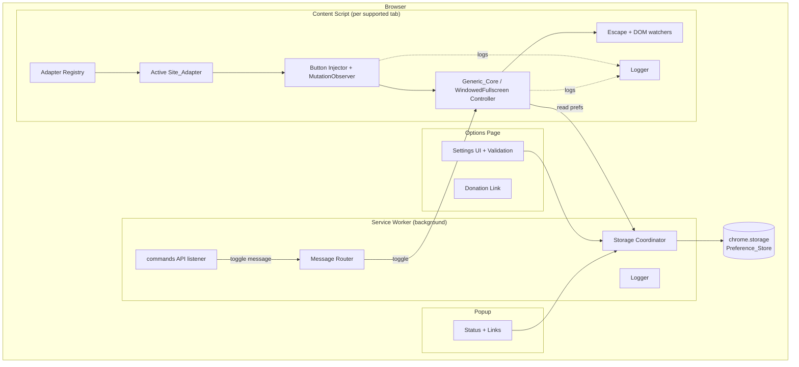

# Design Document

## Overview

The Windowed Fullscreen Extension is a Manifest V3 (MV3) Chromium extension for Google Chrome and Microsoft Edge. It adds a dedicated "windowed fullscreen" control next to a video site's native fullscreen button. Activating it expands the video player to fill the entire browser viewport and hides surrounding site chrome (header, sidebar, comments, scrollbar) **without** calling the browser's native Fullscreen API. Because no fullscreen request is made, the browser stays a normal maximized window, the Windows taskbar remains visible, and Alt+Tab window switching works normally.

The design is built around a **Generic_Core** (site-independent logic) driven by pluggable **Site_Adapters** (per-site DOM knowledge). YouTube is the v1 Supported_Site. The architecture isolates all site-specific selectors inside adapters so new platforms can be added without touching core logic.

### Design Goals

- **Non-invasive viewing mode**: never invoke the Fullscreen API; manipulate layout via injected CSS and reversible DOM/style changes only.
- **Reversibility**: every layout change made on entry is captured beforehand and fully restored on exit.
- **Resilience to SPA navigation**: YouTube and similar sites swap videos without full reloads; the extension re-verifies and re-injects its control as the DOM changes.
- **Extensibility**: a small, well-defined adapter contract keeps the core generic.
- **Graceful degradation**: when the page structure is unexpected, the extension does nothing harmful, logs a diagnostic entry, and leaves the page unchanged.

### Key Design Decisions

| Decision | Rationale |
|---|---|
| Use CSS-class + inline-style manipulation, never `element.requestFullscreen()` | Requirement 2.4 mandates the Fullscreen API is never called so the taskbar stays visible. |
| MutationObserver-driven injection rather than one-shot injection | YouTube is a SPA (Requirement 1.5, 7.4); controls mount/unmount and videos change without reloads. |
| Generic_Core depends only on an adapter-supplied descriptor (player ref, native-control ref, chrome selectors) | Requirement 6.1/6.2 forbid site-specific knowledge in the core. |
| `chrome.commands` API for the keyboard shortcut, relayed to the content script via messaging | MV3 registers shortcuts at the browser level (Requirement 3); the service worker brokers them. |
| `chrome.storage.sync` with `local` fallback, namespaced per-site keys | Requirement 4 persistence and per-site isolation (4.6); sync gives cross-device continuity. |
| State captured as a restore snapshot before any mutation | Requirement 2.6/2.8 require restoration to the exact pre-entry layout. |

## Architecture

The extension has four runtime surfaces defined by MV3: the **content script**, the **service worker**, the **options page**, and the **popup**. The content script hosts the bulk of the logic (core + adapters + injection + controller). The service worker brokers keyboard commands and storage. The options page and popup are UI surfaces.



### Surface Responsibilities

**Content Script** (`content/`): injected on Supported_Site URL matches. On load it asks the Adapter Registry for an adapter matching the current site (Requirement 6.3/6.4/6.6). It runs the injector/observer loop, owns the Generic_Core controller, listens for Escape and toggle messages, and watches for player/control loss.

**Service Worker** (`background/`): registers the `chrome.commands` listener, routes the toggle command to the active tab's content script, coordinates storage reads/writes requested by UI surfaces, and emits diagnostic logs. It is event-driven and may be terminated/restarted by the browser; it holds no critical in-memory state (all durable state is in `chrome.storage`).

**Options Page** (`options/`): renders a control per preference (Requirement 5), validates input, persists via the storage coordinator, shows save confirmations and errors, and renders the Donation_Link (Requirement 8).

**Popup** (`popup/`): lightweight surface showing current-site status (adapter active? mode active?) and links to the options page and Donation_Link.

### Message Flow: Keyboard Toggle

```mermaid
sequenceDiagram
    participant U as User
    participant B as Browser (commands API)
    participant SW as Service_Worker
    participant CS as Content_Script (Generic_Core)
    U->>B: Press configured shortcut
    B->>SW: command "toggle-windowed-fullscreen"
    SW->>SW: Resolve active tab; is it a Supported_Site?
    alt Supported_Site tab
        SW->>CS: sendMessage {type: TOGGLE}
        alt Content script reachable
            CS->>CS: toggle Windowed_Fullscreen_Mode
            CS-->>SW: ack {ok:true, active:boolean}
        else Not reachable
            CS--xSW: no response / error
            SW->>SW: log + surface failure indication (Req 3.6)
        end
    else Not a Supported_Site
        SW->>SW: ignore (Req 3.5)
    end
```

## Components and Interfaces

### Adapter Registry

Holds an ordered list of registered Site_Adapters. Selects the first adapter whose `matches(url)` returns true (Requirement 6.4 — deterministic by registration order). Returns `null` when none match (Requirement 6.6).

```ts
interface AdapterRegistry {
  register(adapter: SiteAdapter): void;
  // Returns the first matching adapter by registration order, or null.
  resolve(url: string): SiteAdapter | null;
}
```

### Site_Adapter Interface

The single contract between the Generic_Core and any site. The core uses **only** what this interface exposes (Requirement 6.1).

```ts
interface SiteAdapter {
  readonly siteId: string;            // e.g. "youtube" — used as the per-site preference key
  matches(url: string): boolean;      // does this adapter handle the current site?

  // Locate the controls container and the native fullscreen button.
  // Returns null when not yet present (caller retries within detection window).
  findControlsContainer(doc: Document): Element | null;
  findNativeFullscreenButton(doc: Document): Element | null;

  // Locate the player element to expand.
  findPlayer(doc: Document): Element | null;

  // CSS selectors / element resolvers for Site_Chrome to hide. May be empty.
  getSiteChromeSelectors(): string[];

  // Optional hook to detect SPA video changes (e.g. URL/videoId change).
  // Returns a disposer. Default no-op.
  onVideoChange?(doc: Document, cb: () => void): () => void;
}
```

A descriptor is what the adapter ultimately resolves to at a given moment:

```ts
interface SiteDescriptor {
  player: Element;
  nativeFullscreenButton: Element;
  controlsContainer: Element;
  siteChromeElements: Element[];      // resolved from selectors; may be empty (Req 2.9)
  missingChromeSelectors: string[];   // selectors that matched nothing (Req 7.3)
}
```

If the adapter cannot supply player + native control + chrome selectors, the core refuses to enter the mode (Requirement 6.2).

### YouTube Site_Adapter

The single v1 adapter (Requirement 6.5). It encapsulates YouTube-specific selectors.

- `matches`: host is `www.youtube.com` / `youtube.com` and a watch context (`/watch`, or an active `#movie_player`).
- `findControlsContainer`: `.ytp-right-controls` (the cluster holding the native fullscreen button).
- `findNativeFullscreenButton`: `.ytp-fullscreen-button`.
- `findPlayer`: `#movie_player` (fallback `.html5-video-player`).
- `getSiteChromeSelectors`: masthead (`#masthead-container`/`#masthead`), secondary/related (`#secondary`), comments (`#comments`), page manager padding (`#page-manager`), and the document scrollbar (handled via a body class). Selectors that are absent are tolerated (Requirement 7.3).
- `onVideoChange`: subscribes to YouTube's `yt-navigate-finish` event and `#movie_player` `videoId` changes to trigger re-verification (Requirement 1.5).

Selectors are centralized in the adapter so a YouTube DOM change is a one-file fix.

### Button Injector + MutationObserver

Responsible for rendering exactly one Windowed_Fullscreen_Button adjacent to the native control and keeping it present across SPA changes.

```ts
interface ButtonInjector {
  start(): void;   // begin observing + attempt initial injection
  stop(): void;    // disconnect observer, remove button
}
```

Behavior:
- Uses a **MutationObserver** on the player/controls subtree plus the adapter's `onVideoChange` hook.
- On each relevant mutation (debounced), it runs `ensureButton()`:
  1. Resolve controls container + native button via adapter.
  2. If a button with the extension's marker attribute (`data-wfs-button`) already exists in the container, keep it — never duplicate (Requirement 1.4).
  3. Otherwise insert the button immediately after the native button (Requirement 1.1) with an accessible name distinct from the native control (Requirement 1.3) and the native control left untouched (Requirement 1.2).
- **Initial detection window**: retries at intervals ≤ 2s, max 10 attempts (Requirement 1.6); abandons after a 10s detection window if the player/native control never appear, logging the reason and leaving the page unchanged (Requirement 7.1/7.2).
- **Re-render after removal** (mode inactive): when the button is removed by the page, re-render within 2s of controls reappearing, up to 5 attempts (Requirement 7.4); if controls do not reappear within 30s, stop and log abandonment (Requirement 7.5).

The button reflects mode state visually: it carries `aria-pressed` and an `is-active` class that track Windowed_Fullscreen_Mode (Requirement 2.10).

### Generic_Core / WindowedFullscreen Controller

Site-independent engine that drives the mode using only a `SiteDescriptor`.

```ts
interface WindowedFullscreenController {
  readonly isActive: boolean;
  enter(descriptor: SiteDescriptor): EnterResult;  // capture -> mutate
  exit(): void;                                     // restore from snapshot
  toggle(resolve: () => SiteDescriptor | null): void;
}

type EnterResult =
  | { ok: true }
  | { ok: false; reason: "incomplete-descriptor" | "already-active" };
```

Enter sequence (≤ 200 ms, Requirement 2.1):
1. Validate descriptor completeness; if incomplete, abort and preserve page state (Requirement 6.2).
2. **Capture** a `LayoutSnapshot`: the player's relevant inline styles/dimensions and, per chrome element, its prior inline `display`/visibility (Requirement 2.8).
3. Apply the windowed class to `documentElement` (hides scrollbar, sets up stacking context).
4. Expand player to `width:100vw; height:100vh; position:fixed; inset:0; z-index:<max>` (Requirement 2.2).
5. Hide each resolved chrome element; tolerate and log absent ones (Requirement 2.9, 7.3).
6. Mark active; set button to engaged state (Requirement 2.10); register the Escape listener.
7. Never call the Fullscreen API (Requirement 2.4).

Exit sequence (≤ 200 ms, Requirement 2.5):
1. Restore player styles and every chrome element's visibility from the snapshot (Requirement 2.6).
2. Remove the windowed class; deregister Escape listener.
3. Mark inactive; set button to inactive state (Requirement 2.10).

Escape handling: while active, a capturing `keydown` listener for `Escape` triggers `exit()` (Requirement 2.7).

Player-loss handling: while active, a watcher detects removal of the player element from the DOM, calls `exit()` to restore chrome from the snapshot, and logs the loss (Requirement 7.6).

### Shortcut Handler (Service Worker side)

- Declares the toggle command and at least one spare unassigned command in the manifest `commands` block (Requirement 3.3).
- On command, resolves the active tab, checks it is a Supported_Site (via match patterns), and sends a `TOGGLE` message (Requirement 3.1, signal ≤ 500 ms).
- Non-supported sites: command is ignored (Requirement 3.5).
- If the content script does not respond (not injected / unreachable), it leaves mode unchanged and surfaces a failure indication (Requirement 3.6).
- Custom combinations are managed through the browser's shortcut UI (`chrome://extensions/shortcuts`); the options page links to it and explains modifier+key rules. Conflicts reserved by the browser cause the prior assignment to be retained, and the options page surfaces a conflict message (Requirement 3.4, 3.2).

### Preference Store

Wraps `chrome.storage` with per-site namespacing and defaults.

```ts
interface PreferenceStore {
  getGlobal(): Promise<GlobalPrefs>;
  setGlobal(p: Partial<GlobalPrefs>): Promise<WriteResult>;
  getSite(siteId: string): Promise<SitePrefs>;     // returns defaults if absent (Req 4.7)
  setSite(siteId: string, p: Partial<SitePrefs>): Promise<WriteResult>;
}

type WriteResult = { ok: true } | { ok: false; error: string };
```

- Per-site values are stored under namespaced keys: `site:<siteId>` so writing one site never affects another (Requirement 4.6).
- Reads return documented defaults when no value exists (Requirement 4.7) or when storage is unavailable/corrupt (Requirement 4.4).
- Writes complete within 1s and, on failure, leave the prior value intact while signaling an error (Requirement 4.2).
- On session start, all preferences load within 2s of init (Requirement 4.3).
- Auto-apply: when enabled for a site, the content script enters the mode within 1s of the player finishing load (Requirement 4.5).

### Options Page

- Renders one control per preference, including auto-apply and a per-site section for each Supported_Site, each reflecting valid input values (Requirement 5.1).
- Renders a shortcut-configuration control (links to the browser shortcuts page) (Requirement 5.2).
- On valid change: persist within 1s and show a saved confirmation (Requirement 5.3).
- On open: shows current stored value per control, or the default when none stored (Requirement 5.4, 5.5).
- On invalid change: reject, retain prior persisted value, show an error identifying the invalid input (Requirement 5.6).
- On persistence failure: retain prior value, show a not-saved error (Requirement 5.7).
- Renders the Donation_Link with a visible label, always visible/activatable, opening the external page in a new tab while keeping the options page open (Requirement 8.1–8.3); on failure to open, shows an error and leaves the page unchanged (Requirement 8.4).

### Logger

A thin diagnostic logger used across surfaces, writing structured entries (timestamp, surface, code, message, context). Used for player-not-found, native-control-not-found, absent chrome elements, re-render abandonment, and player-loss events (Requirements 7.1, 7.2, 7.3, 7.5, 7.6).

## Data Models

### GlobalPrefs

```ts
interface GlobalPrefs {
  schemaVersion: number;          // for migrations
  // Reserved spare action slot is browser-managed; no value stored here.
}
```

### SitePrefs (per Supported_Site)

```ts
interface SitePrefs {
  siteId: string;                 // matches SiteAdapter.siteId
  autoApply: boolean;             // Req 4.5 / 5.1
}

const DEFAULT_SITE_PREFS: Omit<SitePrefs, "siteId"> = {
  autoApply: false,
};
```

Storage layout in `chrome.storage`:

```
{
  "global": { "schemaVersion": 1 },
  "site:youtube": { "siteId": "youtube", "autoApply": false }
}
```

### LayoutSnapshot (restore record captured on entry)

```ts
interface ElementStyleSnapshot {
  // The element's own inline style property values prior to mutation,
  // so restoration reproduces the exact pre-entry inline state (including "not set").
  properties: Record<string, string | null>;
}

interface LayoutSnapshot {
  player: ElementStyleSnapshot;
  chrome: Array<{ selector: string; element: Element; style: ElementStyleSnapshot }>;
  documentElementHadWindowedClass: boolean;
  capturedAt: number;
}
```

The snapshot records, per affected element, the exact inline style values (or `null` when a property was not set inline) so `exit()` reproduces the pre-entry layout precisely (Requirement 2.6/2.8).

### ShortcutCombination (validation model)

```ts
interface ShortcutCombination {
  modifiers: string[];   // e.g. ["Ctrl","Shift"] — at least one
  key: string;           // exactly one non-modifier key
}
```

A combination is valid iff `modifiers.length >= 1` and `key` is exactly one non-modifier key (Requirement 3.2).

### ToggleMessage (service worker ↔ content script)

```ts
type ExtMessage =
  | { type: "TOGGLE" }
  | { type: "GET_STATUS" }
  | { type: "PREF_READ"; scope: "global" | "site"; siteId?: string }
  | { type: "PREF_WRITE"; scope: "global" | "site"; siteId?: string; value: object };

type ExtResponse =
  | { ok: true; active?: boolean; data?: unknown }
  | { ok: false; error: string };
```

## Correctness Properties

*A property is a characteristic or behavior that should hold true across all valid executions of a system — essentially, a formal statement about what the system should do. Properties serve as the bridge between human-readable specifications and machine-verifiable correctness guarantees.*

These properties target the **pure, testable logic** of the extension (injection invariants on a model DOM, the enter/exit state machine and restoration snapshot, adapter resolution, shortcut validation, and the preference store). DOM-dependent logic is tested against a simulated DOM (e.g. jsdom). Timing, messaging plumbing, browser shortcut conflict detection, and UI presence checks are covered by example/integration/smoke tests in the Testing Strategy rather than as properties.

### Property 1: Injection is idempotent and correctly placed

*For any* controls container holding a native fullscreen button (with any number of other sibling controls), running the injector's `ensureButton` operation one or more times — including across a simulated SPA video-change event — results in exactly one Windowed_Fullscreen_Button that is the immediate next sibling of the native button, carries an accessible name that is non-empty and distinct from the native button's accessible name, and leaves the native button's attributes and position unchanged.

**Validates: Requirements 1.1, 1.2, 1.3, 1.4, 1.5**

### Property 2: Entry post-conditions hold

*For any* complete SiteDescriptor (player present, native control present, and a chrome selector set that may be empty), after the Generic_Core enters Windowed_Fullscreen_Mode the player is sized to fill the viewport (full width and full height), every located Site_Chrome element is hidden, and entry completes successfully even when the chrome set is empty.

**Validates: Requirements 2.2, 2.3, 2.9**

### Property 3: Toggle/restore round-trip preserves layout and never goes fullscreen

*For any* DOM containing a player and Site_Chrome elements with arbitrary initial inline styles, capturing the DOM's inline-style state, then entering Windowed_Fullscreen_Mode, then exiting (whether the exit is triggered by re-activating the button or by pressing Escape) restores every affected element's inline styles to exactly the captured pre-entry state; the controller's active flag and the button's engaged/inactive visual state agree at every step; and across the entire sequence the browser Fullscreen API is never called.

**Validates: Requirements 2.1, 2.4, 2.5, 2.6, 2.7, 2.8, 2.10**

### Property 4: Detection and re-render attempts are bounded

*For any* run in which the required elements never become available, the number of initial detection attempts never exceeds 10, and *for any* run in which the button is repeatedly removed while the mode is inactive, the number of re-render attempts never exceeds 5; once a bound is reached, the corresponding loop stops.

**Validates: Requirements 1.6, 7.4**

### Property 5: Shortcut combination validity

*For any* candidate key combination, the validator accepts it if and only if it contains at least one modifier key and exactly one non-modifier key; all other combinations are rejected.

**Validates: Requirements 3.2**

### Property 6: Adapter resolution by registration order gates activation

*For any* ordered list of registered Site_Adapters and any URL, the registry resolves to the earliest-registered adapter whose `matches(url)` is true, or to `null` when none match; the extension dispatches a toggle / injects the button if and only if resolution is non-null.

**Validates: Requirements 6.4, 6.6, 3.5**

### Property 7: Incomplete descriptor refuses entry and preserves state

*For any* SiteDescriptor missing the player reference, the native control reference, or the chrome selectors, the Generic_Core does not enter Windowed_Fullscreen_Mode and the DOM is identical to its state immediately before the entry attempt.

**Validates: Requirements 6.2**

### Property 8: Partial chrome — hide located, log absent, still enter

*For any* chrome selector set in which some selectors resolve to elements and some resolve to nothing, entering Windowed_Fullscreen_Mode hides exactly the located elements, records a diagnostic log entry for each absent selector, and still completes entry.

**Validates: Requirements 7.3**

### Property 9: Player loss while active exits and restores

*For any* active Windowed_Fullscreen_Mode with arbitrary Site_Chrome, removing the player element from the DOM causes the Generic_Core to exit, restore every previously hidden Site_Chrome element to its captured pre-entry state, and record a diagnostic log entry indicating the player was lost.

**Validates: Requirements 7.6**

### Property 10: Preference write/read round-trip with per-site isolation

*For any* site id and any valid SitePrefs value, writing the value and then reading it back returns an equal value; and *for any* two distinct site ids with arbitrary values, writing one site's preferences leaves the other site's stored preferences unchanged.

**Validates: Requirements 4.1, 4.6**

### Property 11: Defaults when preferences are absent or unreadable

*For any* site id with no stored value, reading site preferences returns the documented default values; and *for any* site id when the Preference_Store read fails or returns corrupt data, reading returns the documented defaults and signals a load error.

**Validates: Requirements 4.7, 4.4**

### Property 12: Write failure retains the prior value

*For any* currently stored preference value and any new value, when the Preference_Store write fails, the stored value remains the prior value and the write reports failure.

**Validates: Requirements 4.2**

### Property 13: Options controls reflect the effective value

*For any* set of stored preferences (including missing entries), opening the Options_Page displays, for each control, the stored value when one exists and the documented default when none exists.

**Validates: Requirements 5.4, 5.5**

### Property 14: Options rejects invalid input and retains the prior value

*For any* control and any input outside that control's valid input values, the Options_Page rejects the change, the persisted value remains the previously persisted value, and an error indication identifying the invalid input is shown.

**Validates: Requirements 5.6**

## Error Handling

The extension follows a "fail safe, leave the page unchanged, log a diagnostic" philosophy. No error path is allowed to leave the page in a partially mutated state.

### Detection and injection failures

| Condition | Handling | Requirement |
|---|---|---|
| Player not found within the ≤10s detection window | Skip rendering the button; log "player not found"; leave page unchanged | 7.1 |
| Native control not found within the ≤10s detection window | Skip rendering; log "native control not found"; leave page unchanged | 7.2 |
| Native control not yet present (initial) | Retry at intervals ≤2s, max 10 attempts, then stop | 1.6 |
| Button removed by the page while mode inactive | Re-render within 2s of controls reappearing, up to 5 attempts | 7.4 |
| Controls absent for 30s after removal | Stop re-render attempts; log "re-render abandoned" | 7.5 |

### Mode entry/exit failures

| Condition | Handling | Requirement |
|---|---|---|
| Incomplete descriptor | Do not enter; preserve pre-activation page state | 6.2 |
| Some chrome elements absent | Hide located ones; log each absent selector; continue entering | 7.3 |
| No chrome defined | Enter and expand player without hiding chrome | 2.9 |
| Player removed while active | Exit; restore chrome from snapshot; log "player lost" | 7.6 |

The restoration snapshot is always captured **before** any mutation, so any failure mid-entry can be unwound by applying the snapshot. Entry mutations are applied in an order that allows full rollback from the snapshot if an exception occurs.

### Keyboard shortcut failures

| Condition | Handling | Requirement |
|---|---|---|
| Command on a non-supported site | Ignore; do not toggle | 3.5 |
| Content script unreachable | Leave mode unchanged; surface a failure indication | 3.6 |
| Combination conflicts with a browser-reserved one | Retain previous assignment; show a conflict message identifying the combination | 3.4 |

### Preference store failures

| Condition | Handling | Requirement |
|---|---|---|
| Write fails | Retain prior value; show "not saved" error | 4.2, 5.7 |
| Store unavailable / unreadable / corrupt | Apply documented defaults; show "could not load preferences" error | 4.4 |
| No stored value for a site | Apply documented defaults for that site | 4.7 |
| Invalid options input | Reject; retain prior persisted value; show error identifying invalid input | 5.6 |

### Donation link failures

| Condition | Handling | Requirement |
|---|---|---|
| Donation page cannot be opened | Show "could not open donation page" error; keep options page open and unchanged | 8.4 |

### Diagnostic logging

The Logger records structured entries `{ timestamp, surface, code, message, context }` for all of the above diagnostic cases (player/native not found, absent chrome elements, re-render abandonment, player loss). Logs are written to the extension console and an in-memory ring buffer viewable from the options page for troubleshooting.

## Testing Strategy

The extension uses a **dual testing approach**: property-based tests for universal logic properties, and example/integration/smoke tests for concrete scenarios, plumbing, timing, and configuration.

### Property-Based Testing

PBT applies to the extension's pure and DOM-model logic. We use **fast-check** with a DOM simulated by **jsdom** (the project is TypeScript/JavaScript, the natural language for a Chromium extension). We do **not** implement a property-testing framework from scratch.

Configuration and conventions:
- Each property-based test runs a **minimum of 100 iterations** (`fc.assert(..., { numRuns: 100 })` or higher).
- Each test is tagged with a comment referencing its design property in the format:
  `// Feature: windowed-fullscreen-extension, Property {number}: {property_text}`
- Each correctness property (Properties 1–14) is implemented by a **single** property-based test.
- Generators cover edge cases inline: empty chrome sets (Property 2), arbitrary initial inline styles (Property 3), absent selectors (Property 8), missing/corrupt storage (Property 11), and invalid inputs (Property 14).
- The Fullscreen API is spied/stubbed so Property 3 can assert it is never invoked.
- `chrome.storage` is replaced with an in-memory stub that can be configured to fail, supporting Properties 10–12.

### Unit / Example Tests

Concrete scenarios and error paths that do not generalize across inputs:
- Escape-key exit and toggle wiring (concrete event dispatch).
- Auto-apply enters on player-loaded when enabled, not when disabled (4.5).
- Content-script-unreachable failure indication (3.6).
- Options page: shortcut control present (5.2), valid change persists + confirmation (5.3), persistence-failure error (5.7).
- Donation link: present with label (8.1), stays visible/activatable (8.2), opens new tab keeping options open (8.3), open-failure error (8.4).
- Detection timeout skip + unchanged + log for player (7.1) and native control (7.2); re-render abandonment after 30s (7.5).

### Integration Tests

Cross-surface plumbing and timing, run with 1–3 representative examples (not property-based):
- Keyboard command → service worker → content script toggle within budget (3.1, 3.4 conflict handling).
- Adapter activation on a loaded supported page within budget (6.3).
- Preferences load on session start (4.3).
- End-to-end enter/exit on a YouTube-like fixture page.

### Smoke / Configuration Tests

Single-execution configuration checks:
- Manifest declares the toggle command plus at least one spare unassigned command (3.3).
- Exactly one adapter has `siteId === "youtube"` (6.5).
- Generic_Core module imports no site-specific selectors (architectural boundary check for 6.1).

### Timing Verification

Timing-bound criteria (2.1/2.5/2.7 ≤200 ms; 3.1 ≤500 ms; 4.1/5.3 ≤1 s; 4.3 ≤2 s; 1.1/1.5 ≤2 s) are verified with example tests that measure elapsed time against a fake clock where possible, and with manual/integration verification on real Chrome and Edge builds before publishing to the Chrome Web Store.
